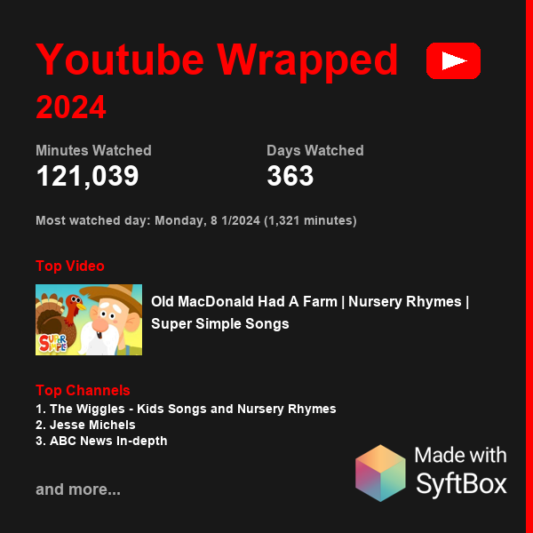
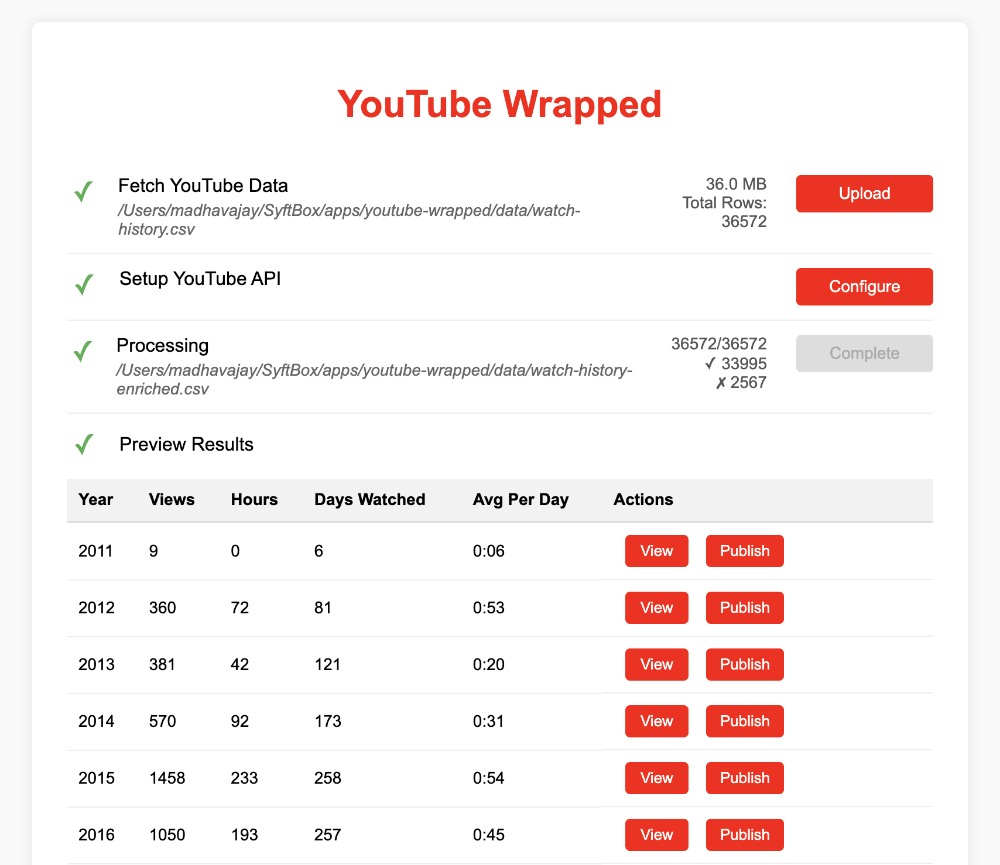

<h1 align="left">🎬 YouTube Wrapped</h1>
<a href="https://github.com/OpenMined/syftbox">
  <picture>
    <source media="(prefers-color-scheme: dark)" srcset="assets/images/mwsyftbox_white_on.png">
    
  </picture>
</a>


## 1-liner Install
Installs SyftBox + youtube-wrapped on MacOS and Linux:
```bash
curl -fsSL https://syftboxdev.openmined.org/install.sh | sh -s -- --apps=https://github.com/madhavajay/youtube-wrapped/
```
```bash
Start the client now? [y/n] y
```

SyftBox can assign a random port so look for something like this:
```
2025-05-20T13:13:16.848+10:00 INF app started app=youtube-wrapped url=http://localhost:53214
```


<h2>Your Watch History, Your Insights, Your Data.</h2>

Tired of platforms hoarding your viewing habits without giving anything back? YouTube Wrapped is like Spotify Wrapped—but for YouTube, and fully under your control.

Just drop in your exported YouTube history and get a beautiful, private summary of your top videos, creators, and moments.

Then, compare your wrapped with friends to see who’s binging what. Want more? Get personalized recommendations powered by open-source AI, based on your actual taste—not what the algorithm wants you to watch.

<h4>Tell me you're a parent, without telling me you're a parent</h4>


## What is SyftBox?

SyftBox is a new platform for building privacy-preserving applications and experiences that work over the internet without uploading your data. Instead of sending your data to a server, SyftBox lets you run powerful AI and analytics locally or in trusted environments, so your personal information stays private and secure.

[read more here](https://github.com/OpenMined/syftbox)


## Installation Steps

To get started with `youtube-wrapped`, follow these steps:

1. **Install Syft Box**:  
   First, you need to install Syft Box. You can find the installation instructions at the following link:  
   [Install Syft Box](https://github.com/OpenMined/syftbox)
   ```bash
   curl -fsSL https://syftboxdev.openmined.org/install.sh | sh
   ```

2. **Install the youtube-wrapped app**:  
   Once Syft Box is installed, you can install the `youtube-wrapped` app using the following command:  
   ```bash
   syftbox app install https://github.com/madhavajay/youtube-wrapped
   ```

3. **Load the UI**:  
   NOTE: the port is random on the newer syftbox.  
   After installing the `youtube-wrapped` app, you can load the user interface by clicking <a href="http://localhost:8080" target="_blank">http://localhost:8080</a> in your web browser. This will allow you to interact with the app and explore its features.

   

4. **Follow the Wizard**:  
   The wizard will guide you through the process of obtaining your data from [Google Takeout](https://takeout.google.com), acquiring a YouTube API v3 key, and enriching your data for comprehensive analysis. This step-by-step process ensures you have all the necessary components to make the most out of your YouTube Wrapped experience.


## Dev Mode
To play around you can kill syftbox and run ./run.sh from the source directory and then you'll get the default port listed in run.sh.
```
SYFTBOX_ASSIGNED_PORT=${SYFTBOX_ASSIGNED_PORT:-8080}
```
<a href="http://localhost:8080" target="_blank">http://localhost:8080</a>
